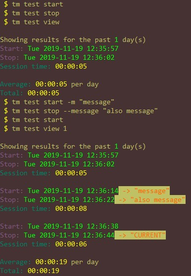
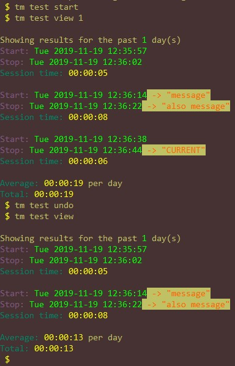
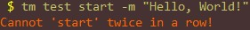

# time_manager

A simple time manager CLI app that I personally use to track my time
studying or working on coding projects.

## Work in progress

This will need some refactoring, but so far, stores timestamps
and messages in a psv (pipe separated values) file when you run
the start and stop commands. When you run
the view command, it converts those to nice-to-read date-time formats
and gives you an average of how many hours you studied for the past
N days. A thorough description is better available in help.txt.
I am glad to say that I have done some major work and refactoring on this,
so it is much better to work with.  
__Check out help.txt for help.__

## Installation

### MacOS/Linux

In your home directory, clone this repo into it like so:

```bash
cd ~
git clone https://github.com/johnisom/time_manager.git
```

Then, in your `~/.bashrc`, `~/.bash_aliases` or `~/.bash_profile`, create an alias
like so:

```bash
alias time_manager="~/time_manager/time_manager.py"
```

This is also acceptable:

```bash
alias tm="~/time_manager/time_manager.py"
```

Then after that alias is loaded (ex. `$ source ~/.bashrc`), you can call the
`time_manager` program from anywhere.

### Windows

Not quite there yet. Unless you have WSL, of course. If that's the case, follow
the above instructions from your bash terminal.

## Dependencies

This relies on python 3.6 or greater (uses f-strings), so make sure you have that installed.
Also, if you dont have the path `/usr/bin/python3`, update the shebang at the top of
`~/time_manager/time_manager.py` from `#!/usr/bin/python3` to `#!/your/path/to/python/3.6/or/greater`.

## Example Usage

<!-- markdownlint-disable MD033 -->
This image shows an example of day to day usage:  


This image shows the functionality of the UNDO command:  


This image shows the built in protection for accidental double starts/stops:  

<!-- markdownlint-enable MD033 -->

## TODOS

* Port from *NIX based to cross-platform compatible (Windows/DOS and *NIX)
* Add more view options such as viewing average hours per week, etc.
  See *display functions* below.
* Add categories of what your time is going to, like coding, working out,
  reading, etc. Will require overhaul of all data structures and processes.
  Very low priority.
* Display functions
  1) DONE ~~*Daily digest*: `--daily-digest`  
     Show only the total times for each day, and then a whole average of that.
     No individual sessions, session times, or messages.~~
  2) DONE ~~*Day delimited*: `--day-delimited`  
     Normal mixed with daily digest. Displays session times as normal, but with
     delimeters ('===', '---', or '=-=-=') between days with total daily time at the end.~~
  3) *Weekly digest*: `--weekly-digest`  
     Show only the total times for each week, and then a whole average of that.
     No individual days or sessions, etc.
  4) *Week delimited*: `--week-delimited`  
     Like day delimited, but instead of showing sessions between delimiters, it shows
     all of the daily digests delimeted by week. Basically daily digest delimited by week
     (Monday thru Sunday).
