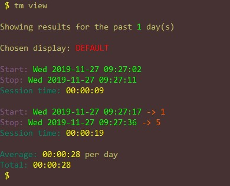
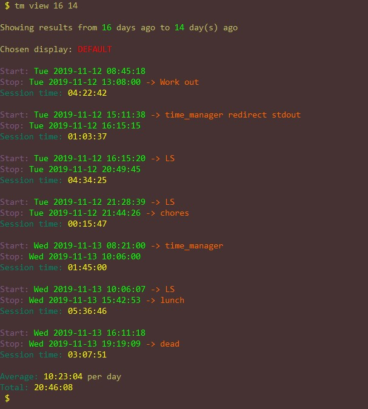
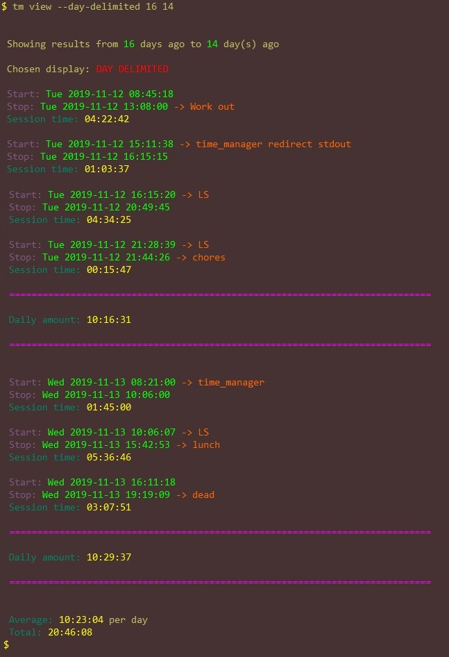
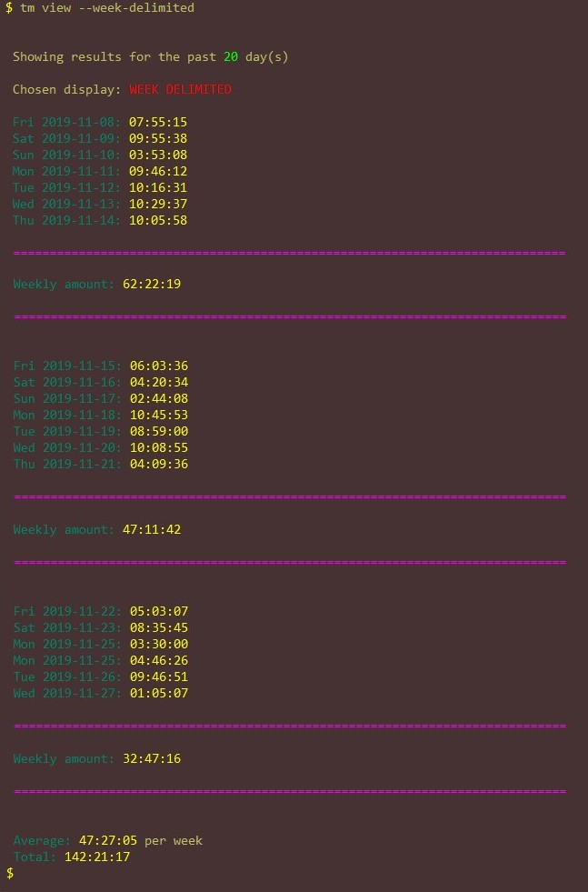

# time_manager

A simple time manager CLI app that I personally use to track my time
studying or working on coding projects.

## Work in progress

This will need some refactoring, but so far, stores timestamps
and messages in a psv (pipe separated values) file when you run
the start and stop commands. When you run
the view command, it converts those to nice-to-read date-time formats
and gives you an average of how many hours you studied for the past
N days. A thorough description is better available in help.txt.
I am glad to say that I have done some major work and refactoring on this,
so it is much better to work with.  
__Check out help.txt for help.__

## Installation

### MacOS/Linux

In your home directory, clone this repo into it like so:

```bash
cd ~
git clone https://github.com/johnisom/time_manager.git
```

Then, in your `~/.bashrc`, `~/.bash_aliases` or `~/.bash_profile`, create an alias
like so:

```bash
alias time_manager="~/time_manager/time_manager.py"
```

This is also acceptable:

```bash
alias tm="~/time_manager/time_manager.py"
```

Then after that alias is loaded (ex. `$ source ~/.bashrc`), you can call the
`time_manager` program from anywhere.

### Windows

Not quite there yet unless you have WSL. If that's the case, you can use this program
from your wsl bash terminal and it works 100%. (After all, that's what I've been doing.)

## Dependencies

This relies on python 3.6 or greater (uses f-strings), so make sure you have that installed.
Also, if you dont have the path `/usr/bin/python3`, update the shebang at the top of
`~/time_manager/time_manager.py` from `#!/usr/bin/python3` to `#!/your/path/to/python/3.6/or/greater`.

## Example Usage

<!-- markdownlint-disable MD033 -->
Demonstration of START, STOP, and UNDO commands:  


The result of running the commmands above:  


Demonstration of choosing to only view within the specified timeframe:  


Same selection but with daily-digest view option used:  


Same selection but with day-delimited view option used:  


Demonstration of weekly-digest view option for all time:  


Same selection but with week-delimited view option:  

<!-- markdownlint-enable MD033 -->

## TODOS

* BUG:  
  Fix day-delimited AND daily-digest. It is showing monday the 25 of Nov as separate days for
  each session, I assume because I didn't log any time Sunday?
  VERY IMPORTANT
* Remove the need to state name. Since this is meant for only a single person
  (uses home directory), it doesn't make sense to require the user to enter
  their name every they use the program.
* Refactor viewing functions. There is a lot of reused code and it's messy,
  so lets DRY things up.
* Port from *NIX based to cross-platform compatible (Windows/DOS and *NIX)
* Add categories of what your time is going to, like coding, working out,
  reading, etc. Will require overhaul of all data structures and processes.
  Very low priority.
